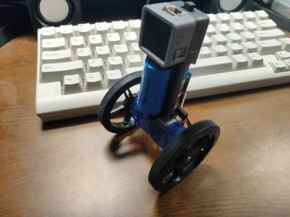

# Self-balancing robot using Atom Matrix, Atom Motion and Rust

This is an implementation of self-balancing robot using M5Stack's Atom Matrix and Atom Motion, written in Rust.

It supports both Atom Matrix (ESP32) and Atom S3 (ESP32-S3).

## Bill of materials
- [Atom Matrix](https://shop.m5stack.com/collections/m5-controllers/products/atom-matrix-esp32-development-kit) or [Atom S3](https://shop.m5stack.com/collections/m5-controllers/products/atoms3-dev-kit-w-0-85-inch-screen?variant=43676991258881) development kit
- [Atom Motion](https://shop.m5stack.com/products/atom-motion-kit-with-motor-and-servo-driver-stm32f0) motor driver kit
- 2x [Feetech FM90](https://japanese.alibaba.com/product-detail/4-legged-robot-design-FM90-DC-60698253697.html) geared motor (looks like a servo but it contains no control circuits)
- 2x [Feetech FS90R-W](https://ja.aliexpress.com/item/33042768123.html) wheels
- Double-sided tape (both foam type and ordinary type)
- Some plastic plates (for reinforcement)

## Usage
Rust toolchains for ESP chips are required. It can be easily installed using [EspUp](https://github.com/esp-rs/espup).

After flashing firmware and turning the switch of Atom Motion, pushing the screen button of an Atom module starts motors.
When the button is pushed again, motors stop.

## Detailed information
For more information, please refer to https://zenn.dev/tana_ash/articles/5a458538cd9204 ([Google Trasnlate](https://zenn-dev.translate.goog/tana_ash/articles/5a458538cd9204?_x_tr_sl=ja&_x_tr_tl=en&_x_tr_hl=ja&_x_tr_pto=wapp)).

## LICENSE
MIT or Apache-2.0.